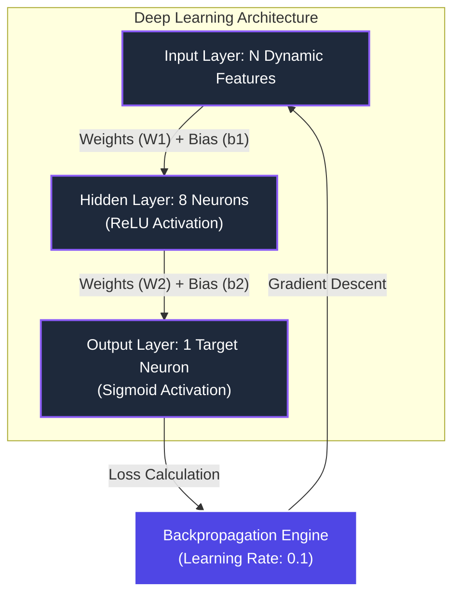
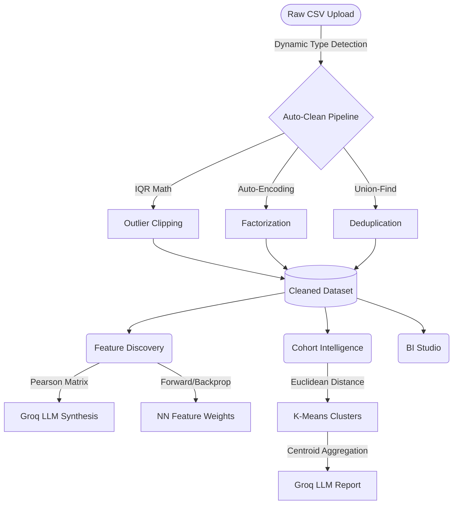

# 🧬 Data Insight Agent

A cutting-edge, enterprise-grade AI data processing platform. 

This is not a wrapper around existing data science libraries. The core mathematical engines (Neural Networks, K-Means Clustering, Pearson Correlation, IQR Outlier Detection) have been engineered **entirely from scratch** in pure Python and NumPy to demonstrate a profound understanding of the underlying mathematics of modern AI.

These from-scratch mathematical engines are then fused with **Generative AI (Groq Llama 3.3)** to dynamically synthesize clinical reports, design composite features, and interpret complex data relationships.

---

## 🚀 Key Features & Architecture

### 1. Universal Data Pipeline
Upload any raw, messy CSV file. The system dynamically detects numeric vs. categorical features and applies an automated cleaning pipeline.
- **Outlier Detection**: Calculates strict IQR bounds from scratch.
- **Universal Imputation**: Auto-handles missing values dynamically.
- **Generic Deduplication**: Mathematically deduplicates identical rows across universal axes.

### 2. Feature Engineering & Discovery
The platform extracts hidden predictive signals from the data without relying on Scikit-Learn.
- **Pearson Correlation Engine**: Calculates the exact Covariance and Standard Deviation matrix purely via NumPy.
- **Neural Network Importance**: Trains a live, from-scratch deep learning model to predict the target variable. The absolute values of the hidden layer weights (`W1`) are extracted to determine feature importance.
- **AI Synthesis**: Feeds the raw mathematical correlation matrices into **Groq's Llama-3.3-70b-versatile** to architect novel composite features and explain the mathematical reasoning.

### 3. Cohort Intelligence (Unsupervised Learning)
- **K-Means from Scratch**: Mathematically clusters data points in N-dimensional space. Features custom initialization and Euclidean distance calculations.
- **Generative AI Reporting**: The aggregated centroid math is securely routed to an LLM to generate plain-English analytical insights and treatment recommendations.

### 4. Native Business Intelligence Studio
Embedded Tableau/PowerBI-style drag-and-drop pivot tables directly inside the app using PyGWalker.

---

## 🧠 System Architecture Diagrams

### From-Scratch Neural Network Engine
*Used for feature extraction and pattern recognition.*



### Full Application Data Flow
*How the mathematical engines interact with Generative AI.*



---

## 💻 Tech Stack
- **Frontend**: Streamlit (Enterprise Slate CSS Theme)
- **Backend & Math**: Python, NumPy, Pandas
- **Visualization**: Plotly Express (Interactive 3D Scatters & Bar Charts)
- **Generative AI**: Groq (Llama-3.3-70b-versatile)
- **BI Tools**: PyGWalker

---

## 🛠️ Installation & Usage

1. **Clone the repository**
   ```bash
   git clone https://github.com/sheetalll28/data-insight-agent.git
   cd data-insight-agent
   ```

2. **Activate the Virtual Environment**
   ```bash
   source env/bin/activate
   ```

3. **Secure API Keys**
   - Create a `.env` file in the root directory.
   - Add your Groq API Key: `GROQ_API_KEY=gsk_...`

4. **Run the Application**
   ```bash
   streamlit run src/app.py
   ```
